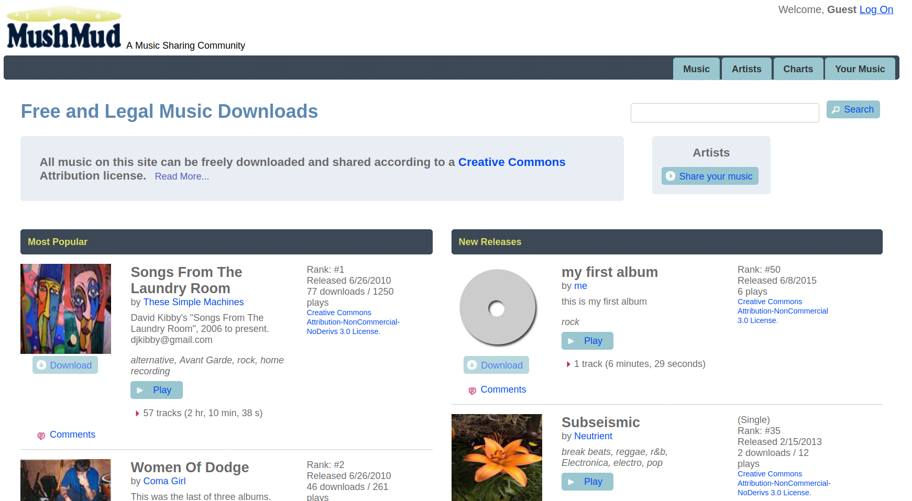
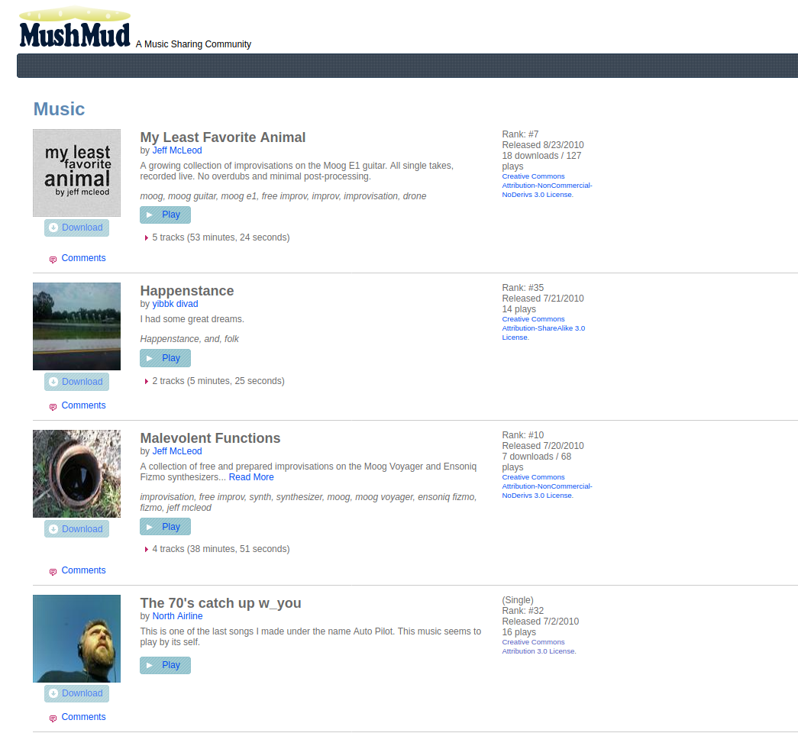
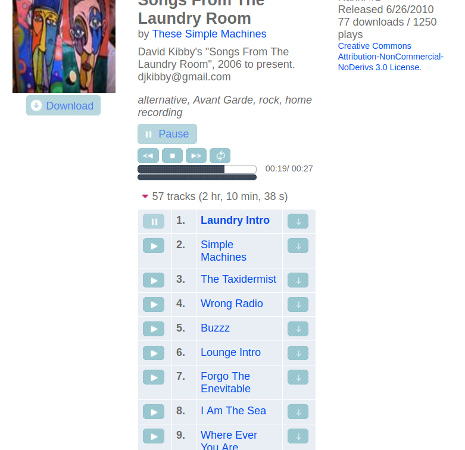
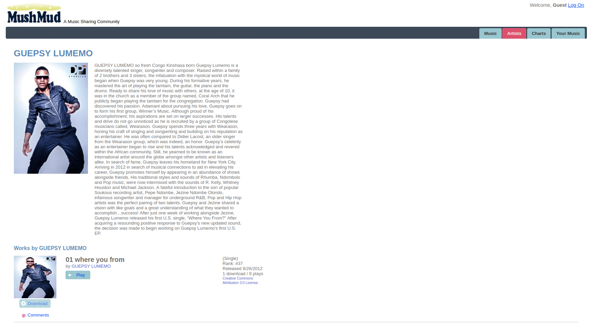
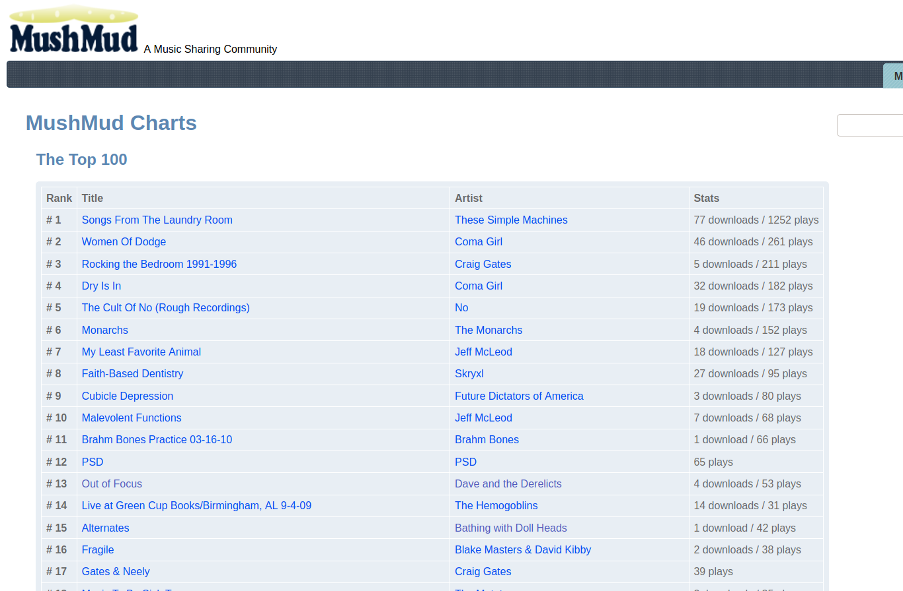

MushMud
=======

ASP.NET MVC application for a music publishing and sharing community.

### Notes:
 - Written in 2009, primarily as a MVC and jQuery learning excercise. (I've learned a lot since!)
 - Of particular interest is the domain model and service layer.  Commands and queries are explicitly separated, utilizing the Agatha Request-Response framework.
 - Streams mp3 using jPlayer (HTML5, falling back to Flash).
 - Converts uploaded WAV and FLAC files to MP3.
 - Stores all binary data (images and audio) in SQL database.  (regrettably)
 - Uses a hand-rolled script bundling scheme.
 - NHibernate for ORM, Spring.NET for IoC.  
 
This site was live as "mushmud.com" from 2009 to 2020.  The site is no longer in production, but preserved here for prosterity.  It has since been [redesigned and re-architected](https://github.com/davidwmartines/trogs).

### Here is what it looked like:

#### Home page:

#### List of Music:

#### Home page:

#### Player:

#### Artist Profile:

#### Charts:

 
